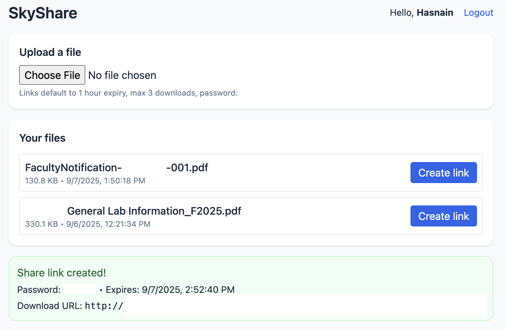

# 🌌 Cloud SkyShare

[](https://github.com/Hasnain-Azam/Cloud-SkyShare/actions)

Cloud SkyShare is a secure, containerized file-sharing platform that demonstrates how to design, build, and automate deployment for a modern full-stack application.
It allows users to upload files, generate expiring download links with password protection, and enforce download quotas — all wrapped in a clean, responsive interface.

The platform is built for clarity and maintainability, with a focus on authentication, scalability, and CI/CD best practices.

## Features
-	Secure File Uploads → Password-protected, expiring download links with custom TTL and max-download limits
-	JWT Authentication → User registration, login, and session management with signed tokens
-	Download Policies → Track file metadata, enforce per-link quotas, and block expired tokens
-	Responsive Frontend → React + Vite UI styled with Tailwind for a crisp, mobile-friendly experience
-	Containerized Architecture → Backend, frontend, and PostgreSQL services orchestrated with Docker Compose
- Automated Delivery → GitHub Actions builds & pushes production images to GitHub Container Registry (GHCR)

## 🖥️ Visuals
<p align="center">
  
  
</p>

##  Tech Stack
- **Frontend:** React + Vite + Tailwind  
- **Backend:** Node.js + Express + JWT auth  
- **Database:** PostgreSQL  
- **Containerization:** Docker + Compose  
- **CI/CD:** GitHub Actions → publishes Docker images to GHCR  

## How to use:
Once containers are up, open http://localhost:5173 to access the app.
```bash
# Clone repository
git clone https://github.com/Hasnain-Azam/Cloud-SkyShare.git
cd Cloud-SkyShare

# Start all services in production mode
docker compose -f docker-compose.prod.yml up --build

